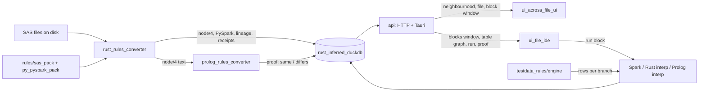

# gold_draft_exp_005_plan — the plan for the final UI v3

**DRAFT** — target `gold_exp_005_plan.md`. Written by Claude on 2026-09-08 at the owner's instruction:
*"write a planning document, lets have one more graph for across files and one for inside the file,
across file should be like what we have, make the new one as exp_005_final_ui_v3 … use rust for
backend and typescript for frontend … we will keep on building our wiki from the code / comments /
git commits and git notes."*

**Why this file exists.** One page that says what we build, from which parts, in what order, and
what "done" means for each step.

**Inputs → outputs.** The owner's brief; the exp_42 Bench (in-file UI, two engines, receipts); the
exp_003 `node4_viz` canvas and its `:8000` API (across-file UI, neighbourhood pattern, DuckDB store);
the exp_004 mockup (the feel); the exp_42 perf spike ([[bronze_perf_receipts_exp42]]) → this plan,
the folder shape, six phases with pass marks.

## 1. What we are building, in one paragraph

One desktop app with two windows over one store. The **across-files window** shows a folder of SAS
programs as files, blocks and tables, seeded from a URL and grown by hops. The **in-file window**
shows one program as SAS ⇄ PySpark cells with its table graph and a bottom strip for output, log and
data match. A **Rust backend** converts each file once with the rules packs, writes the result into
**DuckDB**, and answers small questions from it in milliseconds. A **Prolog proof** of every
conversion runs in the background and turns a receipt green. **TypeScript** draws only what is on
screen. The wiki is grown from doc comments, commit messages and git notes.

## 2. Why now: the two facts that force the shape

1. **Whole-file open does not scale.** The Bench converts the whole file before it answers and
   redraws every cell on every key press. At 1000 blocks that is a 65 s open and a 1.2 s key press
   (receipts in [[bronze_perf_receipts_exp42]]). Rust does the conversion in 0.6 s; the 65 s is the
   Prolog proof run inline.
2. **Neighbourhood open does scale.** `node4_viz` asks the store for a seed plus N hops and gets 4 KB
   in 10 ms, whatever the corpus size. Details of one file come only when it is opened.

So: convert with Rust once, store, ask small, prove later, draw windowed.

## 3. The shape

```
exp_005_final_ui_v3/
  backend/                       Rust workspace (one Cargo.toml, one crate per folder)
    rust_rules_converter/        exp_42 rust_engine: tokenise, fold, print, node/4, PySpark, lineage
    prolog_rules_converter/      runs swipl on the same node/4 for the proof; async; never blocks an open
    rust_inferred_duckdb/        the store (files, blocks, node4, edges, pyspark, receipts) + queries
    testdata_rules/engine/       Z3 test data from node/4 branches (exp_42 testdata + exp_009)
    api/                         HTTP for dev, Tauri commands for the app; one handler set, two doors
  frontend/
    shared/                      tokens (exp_004 feel), URL state, typed API client
    ui_across_file_ui/           node4_viz: React Flow + ELK; explorer | canvas | code + edges strip
    ui_file_ide/                 the Bench in TypeScript: cells (windowed) | table graph | strip
  rules/
    sas_pack/                    rules_pydsl (sas.py) · sas.json · sas.pl · node4_schema · interfaces
    py_pyspark_pack/             rules_pydsl (pyspark.py) · json · .pl · node4_schema · interfaces · generator
    sas_pack/test_data_gen/      z3_rules · generator · interface
    py_pyspark_pack/test_data_gen/
  build_bin/tauri_builder/       tauri.conf, icons, the build script; output = one app bundle
  docs/                          this vault
  tools/wiki_from_git.py         doc comments + commits + notes → bronze pages
```

Each crate and each UI folder starts with a `README.md` that says why it exists and its
inputs → outputs. That README is the seed of its wiki page.

## 4. Data flow



## 5. The store (DuckDB) — tables, one line each

| table | one row per | key columns |
|---|---|---|
| files | SAS file | fileid (relative path), hash, loc, status, converted_at |
| blocks | block | fileid, block_id, n, kind, name, l0, l1, sas_text, py_text, py_pretty, warn |
| node4 | node/4 term | fileid, block_id, seq, term, trace_l0, trace_l1 |
| edges | lineage edge | src_table, dst_table, kind (ds / ctl), fileid, block_id, level (block / file / project) |
| tables | table | name, lib, first_writer_fileid |
| receipts | engine receipt | fileid, statements, folded, roundtrip, node4_same, pyspark_same, proof_state, rust_us, prolog_ms |
| runs | one block run | fileid, block_id, engine, rows, ms, match, first_diff, at |
| events | every write | append-only, for replay (copied idea from `file_dependencies_regex`) |

The `files`, `edges`, `events` shapes come from the `:8000` store; `blocks`, `node4`, `receipts`,
`runs` are the Bench's block model made durable. Parquet export partitioned by folder, as there.

## 6. The API — the questions the UIs may ask

| question | answers | who asks |
|---|---|---|
| `neighborhood(file \| table, up, down)` | files, edges, seeds, run order | across-files |
| `blocklinks(files)` | block → block flows for those files | across-files |
| `file(fileid)` | header, block list (no text), receipts, proof state | both |
| `blocks(fileid, from, to)` | the block window with SAS + PySpark text | in-file (windowed) |
| `tablegraph(fileid)` | tables + edges of one file | in-file |
| `story(table)` | the backward story: makers in order | in-file |
| `run(fileid, block_id, engine, session)` | rows, ms, match | in-file |
| `convert(folder \| file)` | starts conversion; streams `block ready` events | both, on open |
| `proof(fileid)` | pending / same / differs, with the diff | receipt bar |
| `search(q)` | tables and files matching | both |

Every answer is small. Nothing returns a whole program. The URL carries `file`, `block`, `table`,
`up`, `down`, `view`, so a link reopens the same screen.

## 7. What the two UIs keep and what they drop

**Across files (`ui_across_file_ui`)** keeps everything the screenshot shows: explorer with All
Files and Current, the canvas with files expanding into blocks and tables, ELK routing, Pin,
fit / re-layout / expand all / collapse all, the SAS code pane with block-id chips and section
filter, the edges drawer with level and provenance pills. It drops the Python API and reads the
Rust one. Its layout profiles stay (Simple / Medium / Best).

**In file (`ui_file_ide`)** keeps the Bench: two buffers (text ⇄ viewer, `i` / `j` / `g` toggles,
one alone takes the width), the table lineage graph with story on click, the fixed bottom strip
(Block / Output / Terminal / Log / DataMatch), the receipt bar, the command palette, Jupyter
attach, per-file buffers with changed / saved. It takes the exp_004 feel (one header recipe, two
type sizes, flat gutter bands, focus ring, filled status bar). It changes three things:
cells are **windowed** (about 40 in the DOM), a key press **updates classes** instead of
rebuilding, and the graph shows **layers collapsed** above about 150 tables with the clicked
neighbourhood open.

Both windows share `frontend/shared`: the colour tokens (unchanged from the Bench), the URL state,
and the typed client.

## 8. Phases, each with its pass mark

| # | phase | what is done | pass mark (the receipt) |
|---|---|---|---|
| 0 | skeleton + wiki | folders, READMEs, this vault, `wiki_from_git.py` first run | every folder has a README; `wiki_from_git.py` writes one bronze page from one commit |
| 1 | store + converter | copy `rust_engine` → `rust_rules_converter`; add `rust_inferred_duckdb`; `convert(folder)` writes all tables | `big_1000.sas`: convert + store < 3 s; `file()` < 20 ms; `blocks(0,40)` < 20 ms |
| 2 | API + across-files | copy `node4_viz` → `ui_across_file_ui`; point it at the Rust API | the deep link `?file=ankitha_1/11_branch_rollup.sas&up=1&down=1` draws the same 6 files and 7 edges as `:5174` today |
| 3 | in-file window | port the Bench to TypeScript with windowed cells and class-only focus | `big_1000.sas` open to first cell < 1 s; ↓ key < 16 ms; DOM < 25 k elements; graph collapsed by layer |
| 4 | proof in background | `prolog_rules_converter` runs swipl per file off the open path; receipts table; bar turns green | the receipt bar shows pending → same for `test_vishnu_testdata.sas`; a forced diff shows differs with the first line |
| 5 | run + data match + test data | `run()` through Spark / Rust / Prolog; DataMatch strip; `testdata_rules/engine` from exp_42 `gen_testdata.py` + Z3 | the 11 blocks of exp_42's receipt run and match, as `bench_receipt.py` does today |
| 6 | Tauri build | `build_bin/tauri_builder`; backend embedded; two windows | one `.app` opens both windows offline on the ankitha corpus |

Phases 1 and 2 can run in parallel with 3; 4 to 6 follow. Each phase is a bounded task with its own
design in chat and its own commits; each commit gets a git note with the receipt numbers.

## 9. How the wiki grows from the code

- **Doc comments.** Every crate, module and UI folder opens with: why it exists, inputs → outputs.
  `wiki_from_git.py` lifts them into `docs/<dimension>/bronze/bronze_<module>.md`.
- **Commit messages.** First line: what changed. Body: why, and the pass mark hit or missed.
- **Git notes.** `git notes add` on a commit carries the numbers (timings, counts, diff lines).
  The tool appends them to the bronze page as receipts.
- **Curation.** Silver and gold stay hand-written; they link to the generated bronze pages.

## 10. Copies, not rewrites

The full list with paths and sizes is in [[raw_sources_to_copy]]. In short: the Rust engine
(2,800 lines), the pyDSL specs and generated grammars, the codegen `.pl` files and the two
runtime preambles, `node4_viz/src` (whole), the Bench page as the reference for the port, the
exp_004 mockup CSS as the token source, `gen_testdata.py` and `branches.json`, and the store and
service ideas from `file_dependencies_regex` (ideas, not code: that backend is Python).

## Decisions

- **PROVEN ∎** — the two facts in section 2: 65 s open / 1.2 s key press at 1000 blocks; 10 ms
  neighbourhood at `:8000`. Receipts: [[bronze_perf_receipts_exp42]].
- **PROVEN ∎** — Rust converts 1000 blocks in 0.6 s and the two engines agree on node/4 for all
  three big files (`node4_same: true`). Same page.
- **ASSUMED** — DuckDB through the `duckdb` Rust crate is fast enough for the store; the Python
  store in `file_dependencies_regex` is the pattern, not the code.
- **ASSUMED** — React Flow + ELK stays for the across-files canvas (copied), and the in-file table
  graph keeps the Bench's own layered SVG with a collapsed-layer mode; no third layout engine.
- **ASSUMED** — one Cargo workspace, one npm workspace, Tauri v2 wraps both.
- **OPEN** — does the Python pipeline (`pipeline/`) come along at all, or is `rules/*/json` produced
  once by `gen_prolog.py` and checked in? Waits on the owner. My recommendation: check in the
  generated JSON and `.pl`; keep `gen_prolog.py` in `rules/` as the only Python.
- **OPEN** — should the across-files canvas also draw PySpark twins per block, or stay SAS-only as
  `node4_viz` is today? Waits on the owner.
- **OPEN** — the 42 blocks whose PySpark section did not match at 1000 blocks (pretty printer
  trace drift, exp_42) must be fixed in `rust_rules_converter` before phase 3's pass mark is
  honest. Logged, not yet fixed.
